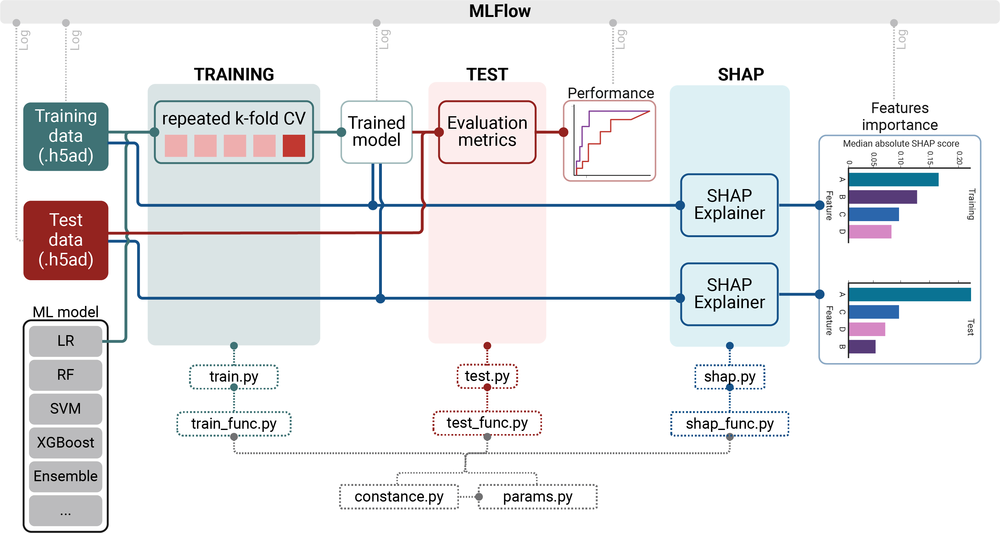

# xML-workFlow: an end-to-end eXplainable Machine Learning workFlow for rapid biomedical experimentation

[](https://arxiv.org/abs/2504.01356) &nbsp;
[](https://github.com/MedicalGenomicsLab/xML-workFlow/blob/main/LICENSE)

`xML-workFlow` is a `scikit-learn` template created to provide an alternative to monolithic scientific codebase. We designed `xML-workFlow` with 3 principles in mind:
- `Modularisation`: Minimum monolithic and maximum modularised code
- `Abstraction`: Don't repeat yourself, i.e. components used repeatedly should be abstracted
- `Tracability`: Tracable training, prediction and explainability with stateful logging of execution code (`@NOTE`: not yet supported) and analyses' arterfacts

By embedding these 3 principles into `xML-workFlow`, we aim to enable biomedical researchers to:
- reduce technical overhead in initiating ML experiments
- rapidly iterate over ML models, data versions, feature engineering techniques, etc with minimal refactoring / restructuring
- maintain visibility and tracibility as ML experiments scale up

<br></br>

<strong>Schematics of xML-workFlow framework</strong>
<br></br>


## Using xML-workFlow
`xML-workFlow` was created as a template repository, i.e. the fastest way to use `xML-workFlow` is via the `Use this template` option.

## Citing xML-workFlow

If you use the `xML-workFlow` template for building machine learning pipelines in your research, please cite the latest version of `xML-workFlow` at:
```bibtex
@article{Tran2025,
  title = {xML-workFlow: an end-to-end explainable scikit-learn workflow for rapid biomedical experimentation},
  url = {https://arxiv.org/abs/2504.01356},
  DOI = {10.48550/arXiv.2504.01356},
  journal = {aRxiv},
  publisher = {aRxiv},
  author = {Tran, Khoa A. and Pearson, John V. and Waddell, Nicola},
  year = {2025},
  month = April,
  pages = {2504.01356}
}
```
